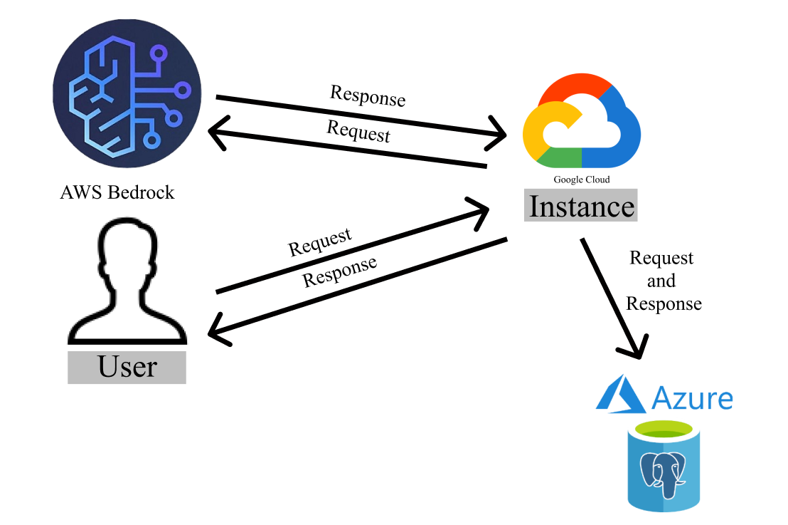

# 🏋️ Gym Assistant

## Súhrn

V tejto úlohe sme si vybrali tému **„Asistent v posilňovni“**.  
Naším cieľom bolo vytvoriť vlastného asistenta s umelou inteligenciou, ktorý pomáha používateľovi dosiahnuť úspech v posilňovni. Asistent zároveň rozdeľuje plán cvičenia podľa jednotlivých svalových skupín.

---

## Využité technológie

- 🧠 **AI-agent:** AWS Bedrock  
- 🗃️ **Dátový sklad:** PostgreSQL (Azure)  
- 🌐 **Frontend a Backend:** Google Cloud (Google Run)  
- 🖥️ **Frontend:** Next.js  
- 🎨 **Dizajn:** Figma  
- 🔧 **Backend:** Flask  

---
## 🖼️ Ukážka diagramu 

Takto vyzerá náš AI asistent v praxi:

## Proces fungovania

1. Používateľ odošle požiadavku z frontendu.
2. Otázka sa odošle do služby AWS Bedrock.
3. Odpoveď sa vráti späť cez Google Cloud (Google Run).
4. Odpoveď sa zobrazí používateľovi a zároveň sa spolu s otázkou uloží do databázy PostgreSQL.

---

## Rozdelenie úloh

- 🙍‍♀️ **Oleksandra Petsa** – Backend  
- 🙍‍♂️ **Nazarii Tymochko** – Frontend  
- 🙍‍♂️ **Andras Jancsik** – Dizajn používateľského rozhrania & Dokumentacia
- 🙍‍♂️ **Daniil Sputai** – AI integrácia (AWS Bedrock)  

---

## Návod na použitie AI asistenta

1. Otvor si prehliadač.
2. Prejdi na tento odkaz:  
   👉 [https://deploy-frontend-835536692802.us-east1.run.app/ai-bot](https://deploy-frontend-835536692802.us-east1.run.app/ai-bot)
3. Otvorí sa chat s naším AI-agentom.
4. Do spodného poľa napíš svoje skúsenosti s cvičením a cieľ tréningu.  
   Asistent ti automaticky pripraví tréningový plán, odporúčania a postupy.
5. Zapni si hudbu v slúchadlách a poďme makať! 💪🎧

---
